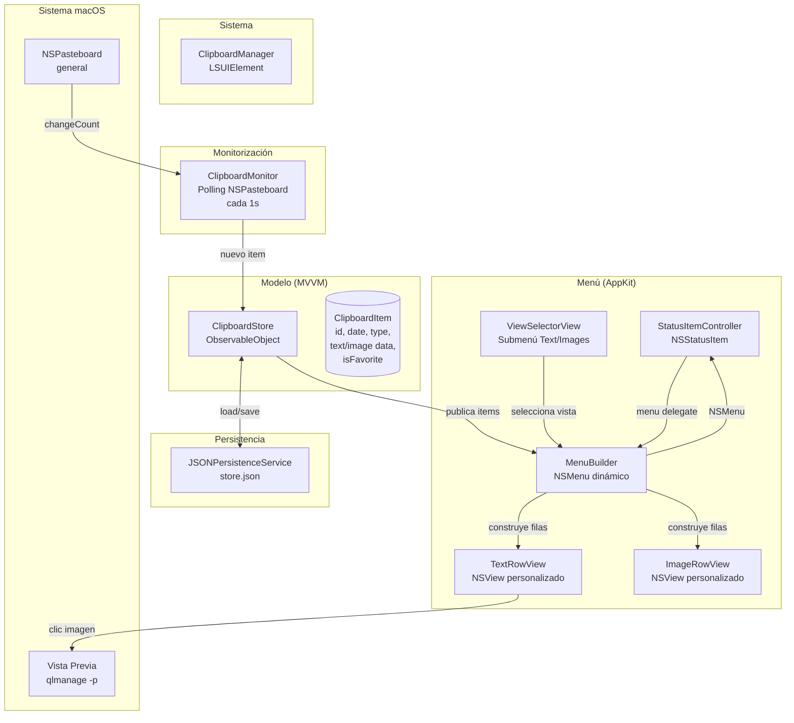

# Clipboard Manager — Diagrama de Arquitectura



## Flujo de datos

```
1. Usuario copia (Cmd+C) → NSPasteboard.changeCount se incrementa
2. ClipboardMonitor detecta el cambio (1s)
3. Lee el contenido del pasteboard
4. Crea ClipboardItem (tipo, datos, timestamp)
5. Lo añade a ClipboardStore
6. ClipboardStore persiste a JSON
7. Siguiente vez que se abre el menú, MenuBuilder lo muestra
8. Si el menú ya está abierto, se refresca inmediatamente
```

## Flujo de vistas

```
Menú principal
├── Submenú "View"
│   ├── "Text" (seleccionado por defecto)
│   └── "Images"
├── Items dinámicos (según vista seleccionada)
│   ├── Texto: TextRowView [30 chars] [⭐] [🗑]
│   └── Imagen: ImageRowView [80×80 thumbnail] [⭐] [🗑]
└── Items fijos
    └── "Quit"
```